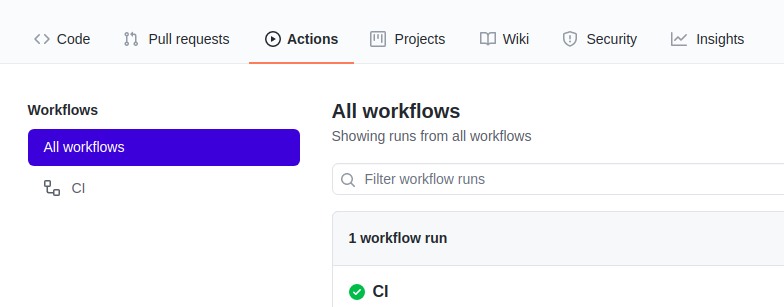

# Shaker

Shaker is a tool to detect flakiness in codebases by introducing noise and load to the execution environment. Shaker currently supports two operation modes: it is  available as a GitHub Actions workflow that can be seamlessly integrated with any GitHub project; and it can also be used via its provided Command Line Interface (CLI). Next, we explain the setup and provide examples of usage for each operation mode.

# GitHub Action

This action uses [Shaker](https://github.com/STAR-RG/shaker) in your GitHub workflow to detect flakiness. If the job ends in failure, flakes were detected and errors will be reported.

Shaker supports Java (`maven-based`) and Python projects (`pytest-based`).

## Usage

Add the following code to your GitHub Actions workflow configuration

```yaml
# Checks-out your repository under $GITHUB_WORKSPACE so Shaker can access it
- uses: actions/checkout@v2
- name: [your-task-name]
  uses: STAR-RG/shaker@main
  with:
    # Tool
    # Currently supported tools: maven, pytest
    # Required
    # Example: tool: maven
    tool: "maven"

    # Pass extra arguments to the tool
    # Optional
    # Example: extra_arguments: -DModule.skip.tests=true
    extra_arguments: ""

    # Number of Shaker runs
    # Optional, default: 3
    # Example: runs: "3"
    runs: "3"
```

## Inputs

| Input | Description |
| --- | --- |
| `tool` | Specifies the tool required to run the tests. Currently supported: `maven` and `pytest`. |
| `extra_arguments` | Optional. Passes extra arguments to the testing tool. For example, you can pass `-DModule.skip.tests=true` to tell Maven to skip a certain module. |
| `runs` | Optional, default: 3. Specifies how many times Shaker will run. |
|`no_stress_runs`|  Optional. default: 0. Specifies how many times ReRun (without noise) will run. |

## Usage Example

Fork the repository below to test Shaker: [https://github.com/STAR-RG/java-application-test](https://github.com/STAR-RG/java-application-test)
1. `git clone` your fork or your own project.
2. Into the project, create a folder called `.github/workflows`.
```bash
mkdir -p .github/workflows
```
3. Create a file `.yml`, for example `main.yml`.
```bash
touch .github/workflows/main.yml
```
4. Write the action that runs Shaker in the `.yml` file.


```yaml
name: CI # This is a basic workflow to help you get started with Actions 

# Controls when the action will run. 
on:
  # Triggers the workflow on push or pull request events but only for the main branch
  push:
    branches: [ main ]
  pull_request:
    branches: [ main ]

  # Allows you to run this workflow manually from the Actions tab
  workflow_dispatch:

# A workflow run is made up of one or more jobs that can run sequentially or in parallel
jobs:
  # This workflow contains a single job called "build"
  build:
    # The type of runner that the job will run on
    runs-on: ubuntu-latest

    # Steps represent a sequence of tasks that will be executed as part of the job
    steps:
      # Checks-out your repository under $GITHUB_WORKSPACE, so your job can access it
      - uses: actions/checkout@v2
      - name: Java tests
        uses: STAR-RG/shaker@main
        with:
          tool: maven
          runs: 3
```
Ok, now you can commit and push to your github
```bash
git add .github
git commit -m "add shaker action"
git push
```
Your trigger is configured, every time you commit or pull request on the main branch the action will be triggered.
Now just make a simple commit and your workflow will run in github action. 

```bash
git commit --allow-empty -m "emptry commit to trigger the action"
```

Now go to your fork/project on the browser and select the 'Actions' tab. 
This step should take around 4 minutes to complete.
When the Action finishes running you should see


# Command Line Interface (CLI)
If you want to run a shaker in your environment, just do this:

## Usage

Install stress-ng
```bash
sudo apt-get install stress-ng
```
## Example

Download shaker and our project
```bash
git clone https://github.com/STAR-RG/shaker
git clone https://github.com/STAR-RG/java-application-test
```
Run shaker:
```bash
shaker/shaker/shaker.py --stress-runs 4 maven "java-application-test"
```
If Shaker finds flaky the results are printed on the terminal. Otherwise nothing is printed on the terminal.

```
usage: shaker.py [-h] [-e EXTRA_ARGUMENTS] [-o OUTPUT_FOLDER] [-sr STRESS_RUNS] [-nsr NO_STRESS_RUNS] {pytest,maven} directory

positional arguments:
  {pytest,maven}        specify testing tool
  directory             specify directory

optional arguments:
  -h, --help            show this help message and exit
  -e EXTRA_ARGUMENTS, --extra-arguments EXTRA_ARGUMENTS
                        specify extra arguments
  -o OUTPUT_FOLDER, --output-folder OUTPUT_FOLDER
                        specify output folder
  -sr STRESS_RUNS, --stress-runs STRESS_RUNS
                        specify number of stress runs
  -nsr NO_STRESS_RUNS, --no-stress-runs NO_STRESS_RUNS
                        specify number of no-stress runs
```

In this example, Shaker ran the tests 17 times: 1 no-stress runs and 4 (* 4 configurations) stress runs. The following test passed all no-stress runs but failed 4 stress runs, corresponding to 23.53% out of the 17 runs due to an assertion error. If the same test failed with different issues, the errors will be reported as well.

```
$ ./shaker.py --no-stress-runs 1 --stress-runs 4 maven "project/path"

==== Failure in module com.project.MyModule ====
     > at testExample
       No stress failures: 0 (0.00%)
       Stress failures: 4 (23.53%)

       > Descriptions: 
         java.lang.AssertionError: null
         	at org.testng.Assert.fail(Assert.java:89)
         	at org.testng.Assert.assertNotEquals(Assert.java:739)
         	at org.testng.Assert.assertNotEquals(Assert.java:744)
         	at com.project.MyModule.testExample(MyModule.java:100)
```
